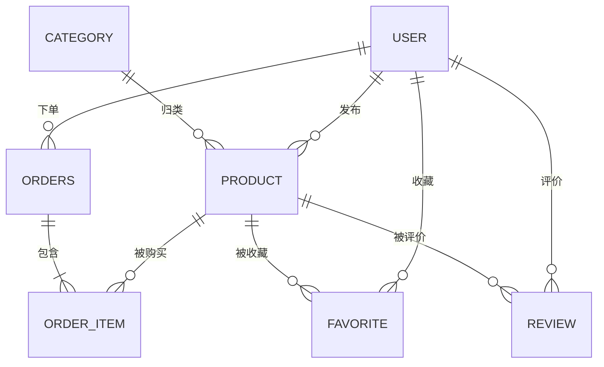

# CampusMart · 校园二手交易平台

> 一个从 0 到 1 手写后端的学习型项目：不做花活，只把每个技术点真正落地一遍。

## 项目定位

面向校园场景的二手物品交易平台。核心链路：

**发布商品 → 浏览 / 搜索 → 收藏 → 下单 → 订单流转 → 评价**

学习目标：覆盖一个真实后端项目需要的完整能力栈——分层架构、ORM、认证鉴权、缓存、并发与事务、接口文档、部署。

## 技术栈

| 层次 | 选型 | 版本 |
|---|---|---|
| 语言 | Java | 17 |
| 框架 | Spring Boot | 4.x |
| 持久层 | MyBatis-Plus | 3.5.17 |
| 数据库 | MySQL | 8.x |
| 缓存 | Redis | 7.x（后续阶段） |
| 认证 | JWT（后续阶段） | — |
| 构建 | Maven | 3.9+ |
| 接口文档 | Knife4j / SpringDoc | 后续引入 |

## 分层结构约定

```
com.itcjj.campusmart
├── controller     接口层：参数校验、调用 service、返回统一响应
├── service        业务层：业务规则、事务边界
│   └── impl
├── mapper         持久层：MyBatis-Plus Mapper 接口
├── entity         数据库实体（与表一一对应）
├── dto            入参对象（Data Transfer Object）
├── vo             出参对象（View Object）
├── common         统一响应、错误码、常量
└── exception      自定义异常 + 全局异常处理器
```

约定：
- Controller **不写业务逻辑**，Service 只抛 `BizException`，异常统一由 `@RestControllerAdvice` 兜底
- 实体类不直接出入接口，入参用 dto、出参用 vo
- 统一响应体：`{ "code": 0, "msg": "success", "data": {...} }`

## 数据库设计

七张核心表：`user` / `category` / `product` / `order` / `order_item` / `favorite` / `review`



> - 完整字段定义（字段、类型、注释、索引规划）见 [`docs/er-diagram.md`](docs/er-diagram.md)
> - 注：`order` 是 MySQL 保留字，物理表名建议用 `orders`，Day 3 建表时确认

## 进度

### Phase 1 · Java 后端基础

- [x] **Week 00 · 起手**
  - [x] Java 异常 / IO / Jackson JSON
  - [x] 仓库初始化 + README 骨架
  - [x] ER 图设计与评审
  - [x] `.gitignore` + Git 提交规范
  - [ ] Spring Boot 工程骨架（Day 2）
  - [ ] 用户表 CRUD 打通（Day 3）
- [ ] Week 01 · 待补充

### Phase 2 · 业务开发

### Phase 3 · 进阶与部署

## 提交规范

采用 [Conventional Commits](https://www.conventionalcommits.org/)，格式：

```
<type>(<scope>): <subject>
```

| type | 含义 |
|---|---|
| feat | 新功能 |
| fix | 修 bug |
| docs | 文档 |
| refactor | 重构（不改行为） |
| test | 测试 |
| chore | 构建 / 依赖 / 配置 |
| style | 格式（不影响逻辑） |

示例：
```
feat(user): 新增用户注册接口
fix(order): 修复库存扣减并发下超卖问题
docs(readme): 补充 ER 图说明
chore: 升级 mybatis-plus 到 3.5.7
```
