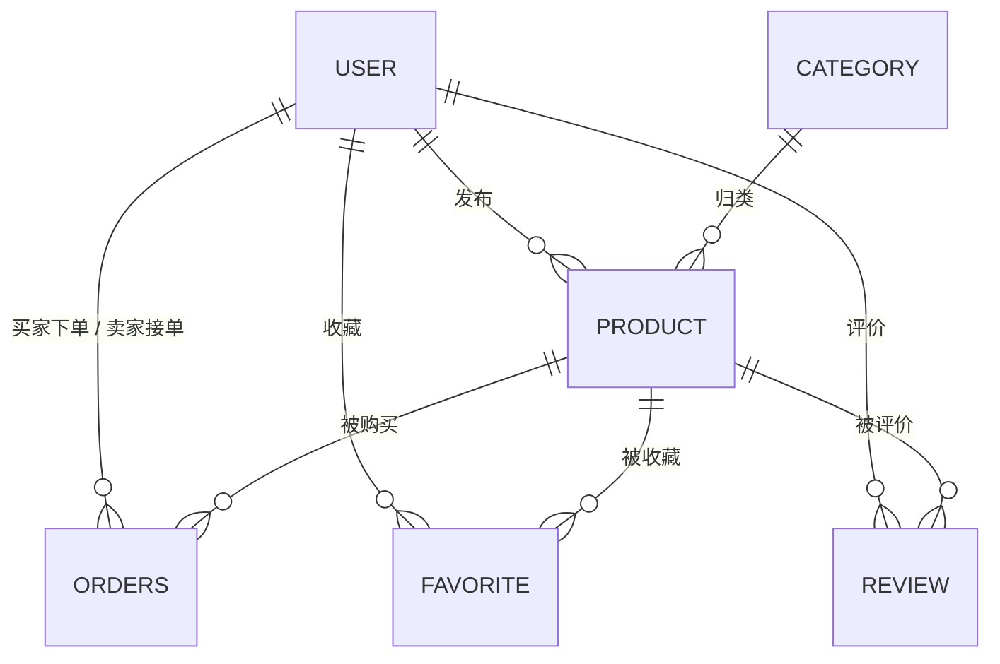

# CampusMart · 校园二手交易平台

> 一个从 0 到 1 手写后端的学习型项目：不做花活，只把每个技术点真正落地一遍。

## 项目定位

面向校园场景的二手物品交易平台。核心链路：

**发布商品 → 浏览 / 搜索 → 收藏 → 下单 → 订单流转 → 评价**

学习目标：覆盖一个真实后端项目需要的完整能力栈——分层架构、ORM、认证鉴权、缓存、并发与事务、接口文档、部署。

## 快速开始

**前置**：JDK 17+ ｜ Maven 3.9+ ｜ MySQL 8.x（本地 3306）｜ **Redis（本地 6379）**

### 1. 建库建表

```bash
mysql -u root -p < sql/init.sql
```

### 2. 启动 Redis

商品详情接口用 Redis 做缓存，**启动项目前必须先把它跑起来**，否则 `GET /product/{id}` 会报连接错误。

```bash
redis-server                       # Mac / Linux
# Windows：双击 redis-server.exe，并保持那个黑窗口开着（关掉 = 服务停了）
```

验证：

```bash
redis-cli ping                     # 返回 PONG 就对了
```

### 3. 生成配置文件

```bash
# Windows
copy src/main\resources\application.yml.example src\main\resources\application.yml
# Mac / Linux
cp src/main/resources/application.yml.example src/main/resources/application.yml
```

然后改 `application.yml` 里这三项：

| 配置项 | 说明 |
|---|---|
| `spring.datasource.password` | 你的数据库密码 |
| `campusmart.jwt.secret` | 随机长字符串，至少 32 字符 |
| `campusmart.upload.path` | 上传文件存放目录，**结尾必须带 `/`**，目录不存在会自动创建 |

> ⚠️ `application.yml` 含数据库密码，已被 `.gitignore` 排除，**不会进入仓库**。
> 因此改了 `application.yml` 一定要同步更新 `application.yml.example`，否则别人克隆后跑不起来。

### 4. 启动

```bash
mvn spring-boot:run
```

（IDEA 里直接运行 `CampusMartApplication` 也可以）

### 5. 验证

浏览器打开 **`http://localhost:8080/index.html`** —— 内置的**用户模块接口测试台**（与后端同源部署，无需额外配置）。

可以直接注册 / 登录 / 调用全部接口，右侧实时显示每次请求的耗时与业务 code，点开可看请求体与响应原文。

也可以把 [`http/campusmart-user-test.postman_collection.json`](http/campusmart-user-test.postman_collection.json)
导入 Apifox / Postman，一次跑完 **43 条接口自测用例**（含边界与权限用例）。

## 技术栈

| 层次 | 选型 | 版本 |
|---|---|---|
| 语言 | Java | 17 |
| 框架 | Spring Boot | 4.x |
| 持久层 | MyBatis-Plus | 3.5.17 |
| 数据库 | MySQL | 8.x |
| 认证 | JWT（jjwt） | 0.12.6 ✅ 已实现 |
| 密码加密 | Spring Security Crypto（BCrypt） | 已实现 |
| 参数校验 | spring-boot-starter-validation | 已实现 |
| 缓存 | Redis（`StringRedisTemplate`） | ✅ 已实现（本地 5.0.14） |
| 构建 | Maven | 3.9+ |
| 接口文档 | Knife4j / SpringDoc | 后续引入 |

## 分层结构约定

```
com.itcjj.campusmart
├── controller     接口层：参数校验、调用 service、返回统一响应
├── service        业务层：业务规则、事务边界
│   └── impl
├── mapper         持久层：MyBatis-Plus Mapper 接口
├── entity         数据库实体（与表一一对应）
├── dto            入参对象（Data Transfer Object）
├── vo             出参对象（View Object）
├── common         统一响应、错误码、常量
└── exception      自定义异常 + 全局异常处理器
```

约定：
- Controller **不写业务逻辑**，Service 只抛 `BizException`，异常统一由 `@RestControllerAdvice` 兜底
- 实体类不直接出入接口，入参用 dto、出参用 vo
- 统一响应体：`{ "code": 0, "msg": "success", "data": {...} }`

> ⚠️ **当前状态与差距**：入参已全部使用 dto；**出参仍全部直接返回实体**
> （`/user/me`、`/user/list` 返回 `User`；`/product/*` 返回 `Product`）。
> 密码已用 `@JsonIgnore` 挡住，但 `deleted`、`tokenVersion`、`sellerId`
> 这类内部字段仍会暴露给前端。
> **待办**：补 `vo` 层，把这些接口改为返回 VO。

## 数据库设计

六张核心表：`user` / `category` / `product` / `orders` / `favorite` / `review`


```mermaid
erDiagram
    USER ||--o{ PRODUCT  : "发布"
    USER ||--o{ ORDERS   : "买家下单 / 卖家接单"
    USER ||--o{ FAVORITE : "收藏"
    USER ||--o{ REVIEW   : "评价"
    CATEGORY ||--o{ PRODUCT : "归类"
    PRODUCT  ||--o{ ORDERS   : "被购买"
    PRODUCT  ||--o{ FAVORITE : "被收藏"
    PRODUCT  ||--o{ REVIEW   : "被评价"
```

> - 完整字段定义（字段、类型、注释、索引规划）见 [`docs/er-diagram.md`](docs/er-diagram.md)
> - 注：`order` 是 MySQL 保留字，物理表名用 `orders`
> - ⚠️ **没有独立的 `order_item` 明细表**：校园二手每件商品都是孤品（一单一品），
>   商品标题 / 图片 / 金额**快照直接内联在 `orders` 表**。这是刻意的建模决策，不是省略。
> - 已完成建表：`user` / `category` / `product` / `orders`（见 [`sql/init.sql`](sql/init.sql)）

## 已实现接口

### 用户模块

| 方法 | 路径 | 说明 | 权限 |
|---|---|---|---|
| GET | `/hello` | 连通性测试 | 公开 |
| POST | `/user/register` | 注册（用户名唯一校验） | 公开 |
| POST | `/user/login` | 登录，返回 JWT | 公开 |
| GET | `/user/me` | 获取当前登录用户 | 需登录 |
| PUT | `/user/password` | 修改密码（校验原密码） | 需登录 |
| POST | `/user/avatar` | 上传头像 | 需登录 |
| GET | `/user/list` | 查询用户列表 | 需 ADMIN |
| POST | `/user/add` | 新增用户 | 需登录 |
| PUT | `/user/update` | 修改用户资料（只更新传入字段） | 本人或 ADMIN |
| DELETE | `/user/delete/{id}` | 删除用户（逻辑删除） | 需 ADMIN |

### 分类模块

| 方法 | 路径 | 说明 | 权限 |
|---|---|---|---|
| GET | `/category/list` | 查询全部分类 | 需登录 |

### 商品模块

| 方法 | 路径 | 说明 | 权限 |
|---|---|---|---|
| POST | `/product/publish` | 发布商品（**卖家从 token 取，不信前端**） | 需登录 |
| PUT | `/product/update` | 编辑商品（**校验归属权**） | 仅卖家 |
| PUT | `/product/offline/{id}` | 下架商品（**校验归属权**） | 仅卖家 |
| DELETE | `/product/delete/{id}` | 删除商品（逻辑删除，**校验归属权**） | 仅卖家 |
| GET | `/product/list?categoryId=` | 按分类查在售商品 | 需登录 |
| GET | `/product/search` | 关键字 + 价格区间 + 成色 + 排序 + 分页 | 需登录 |
| GET | `/product/{id}` | **商品详情（Redis 缓存 + 空值防穿透）** | 需登录 |
| POST | `/product/images` | 商品多图上传（最多 9 张） | 需登录 |

> ⚠️ **商品接口的越权防护**：`update` / `offline` / `delete` 三个接口
> 都会先查出商品的 `sellerId`，与当前登录用户比对，不一致直接返回 `403`。
> （实测：用 A 账号改 B 账号发布的商品 → `403 无权限访问`）

### 商品详情缓存设计

```
GET /product/{id}
  ↓ ① get("product:detail:{id}")
    ├─ 有值    → 反序列化直接返回（不碰数据库）
    ├─ 空串 "" → 上次查过确实没有 → 直接返回 2001（防穿透）
    └─ null    → 没缓存过，继续 ↓
  ↓ ② selectById(id)
    ├─ 查到 → 写回 Redis（TTL 30min）→ 返回
    └─ 没有 → 写空值标记 ""（TTL 1min）→ 返回 2001
```

- **两档 TTL**：真数据 30 分钟；空值标记只 1 分钟（id 可能马上被创建出来，不能长期误判）
- **Redis 存不了 `null`**，用空串 `""` 代表「这个 id 确实不存在」
- **Cache Aside**：改 / 下架 / 删商品时 `redisTemplate.delete` 清缓存，
  顺序是**先更新数据库，再删缓存**（反了会被读请求用旧值回填）
- **压测实测**：4000 次并发请求，缓存命中率 **99.88%**，MySQL 实际只被查询 **5 次**

统一响应格式：`{"code": 0, "msg": "ok", "data": ...}`，`code = 0` 表示成功。

### 认证与权限

- 登录后签发 **JWT**，之后请求带 `Authorization: Bearer <token>`
- 拦截器校验顺序：**签名 → 过期 → token 版本号 → 接口权限注解**
- token 内携带 `role`，配合自定义注解 `@RequireAdmin` 做接口级鉴权
- `token_version` 机制：**改密码时版本号 +1，该用户所有已签发 token 立即失效**
  （解决「无状态 JWT 无法撤销」的固有问题）
- 状态码语义：**401 = 未登录 / 403 = 已登录但权限不足**，前端分开处理

### 安全相关实现

| 项 | 做法 |
|---|---|
| 密码存储 | BCrypt（自带随机盐 + 慢哈希 + 可调 cost），数据库不存明文 |
| 入参校验 | Bean Validation + 校验分组 + 自定义注解 `@Phone` |
| 越权防护 | 带 id 的写接口校验归属（改资料：本人或管理员；删除：仅管理员） |
| 文件上传 | UUID 重命名防路径穿越、扩展名白名单、**文件头魔数校验**、大小上限 |
| 敏感信息 | 密码/token 不进日志；实体类不出入接口（密码字段 `@JsonIgnore`） |

### 错误码分段规划

| 段位 | 用途 |
|---|---|
| `0` | 成功 |
| `4xx` | 参数错误 / 无权限 |
| `5xx` | 服务端异常 |
| `10xx` | user 模块 |
| `20xx` | product 模块 |
| `30xx` | order 模块 |

已定义错误码见 [`common/CodeEnum.java`](src/main/java/com/itcjj/campusmart/common/CodeEnum.java)：

| code | 含义 | 场景 |
|---|---|---|
| `0` | ok | 成功 |
| `400` | 具体字段提示 | 参数校验失败 / 上传文件超过大小上限（提示语动态返回） |
| `401` | 请先登录 | 未带 token、token 无效、token 已过期、**token 已被撤销**（版本号不符） |
| `403` | 无权限访问 | 已登录但权限不足（如普通用户访问管理员接口 / 改他人资料） |
| `1001` | 用户名已存在 | 注册 / 新增用户 |
| `1002` | 用户不存在 | 更新或删除一个不存在的用户 |
| `1003` | 用户名或密码错误 | 登录失败（**不区分「用户不存在」与「密码错」，防账号枚举**） |
| `1004` | 原密码错误 | 修改密码时原密码校验失败 |
| `1005` | 上传文件不能为空 | 上传头像时没带文件 |
| `1006` | 只支持 jpg / jpeg / png / gif / webp 格式 | 扩展名白名单或文件头魔数校验不通过 |
| `1007` | 文件上传失败 | 落盘 IO 异常 |
| `2001` | 商品不存在 | 查询 / 编辑 / 下架 / 删除一个不存在的商品；**也用作缓存空值防穿透的落点** |
| `2002` | 最多上传 9 张图片 | 商品多图上传超过数量上限 |

> 业务异常与未预料的异常（空指针、数据库断开等）一律由
> [`GlobalExceptionHandler`](src/main/java/com/itcjj/campusmart/exception/GlobalExceptionHandler.java)
> 统一捕获并转换为上述格式，**Controller 层不写 try-catch**。
>
> 分级原则：**预期的业务分支记 `warn`，真正的意外记 `error`（带堆栈 + 接口路径）**。

```jsonc
// POST /user/add —— 用户名重复时的实际返回
{"code": 1001, "msg": "用户名已存在", "data": null}
```

## 进度

### Phase 1 · Java 后端基础

- [x] **Week 00 · 起手**（9.10 ~ 9.13）
  - [x] Java 异常 / IO / Jackson JSON
  - [x] 集合框架（ArrayList vs LinkedList / HashMap 底层 / HashSet / 泛型擦除）
  - [x] 并发基础（线程创建与生命周期 / 竞态条件 / synchronized / volatile / 线程池）
  - [x] 仓库初始化 + README 骨架
  - [x] ER 图设计与评审（7 张表）
  - [x] `.gitignore` + Git 提交规范
  - [x] Spring Boot 工程骨架（4.1.1 + Java 17 + Maven）
  - [x] 接入 MySQL + MyBatis-Plus（逻辑删除、时间字段自动填充）
  - [x] **用户模块 CRUD 四个接口跑通**
- [x] **Week 01 · 用户认证**（9.14 ~ 9.20）✅
  - 目标：分层规范 / 统一响应 / 全局异常处理 / JWT 注册登录 / 角色权限
  - [x] **Day 1 · 分层规范 + 统一响应 + 全局异常处理**
    - [x] `Result<T>` 统一响应体 + `CodeEnum` 错误码枚举
    - [x] `BizException` 业务异常 + `GlobalExceptionHandler` 全局兜底
    - [x] 用户名唯一性校验（Service 层抛异常，Controller 零 try-catch）
  - [x] **Day 2 · JWT 原理 + 注册 / 登录接口**
    - [x] `JwtUtil`（jjwt 0.12.6）：签发 / 解析 token
    - [x] `POST /user/login` 登录接口（签发 token）
    - [x] `POST /user/register` 注册接口
    - [x] 登录失败统一提示「用户名或密码错误」，不泄漏用户名是否存在
  - [x] **Day 3 · 拦截器 + ThreadLocal 用户上下文**
    - [x] `LoginInterceptor` 解析 token 写入 `UserContext`
    - [x] `ThreadLocal` 存 `CurrentUser` 对象，`afterCompletion` 统一清理
    - [x] Service 层无需传 userId 即可取当前用户
  - [x] **Day 4 · 参数校验 + 角色权限控制**
    - [x] Bean Validation + **校验分组**（注册 / 更新复用同一 DTO）
    - [x] **自定义校验注解 `@Phone`**（注解 + `ConstraintValidator` 两件套）
    - [x] 角色权限：`role` 字段 + JWT claim + 自定义注解 `@RequireAdmin`
    - [x] 统一日志基建（SLF4J 分级、敏感字段不入日志）
  - [x] **Day 5 · BCrypt 密码加密 + 用户信息管理**
    - [x] BCrypt 替换明文密码（`PasswordConfig` + `encode` / `matches`）
    - [x] **`token_version` 撤销机制**：改密码后所有旧 token 失效
    - [x] `PUT /user/password` 修改密码（校验原密码）
    - [x] `POST /user/avatar` 头像上传（磁盘存储 + 静态资源映射 + 三重安全校验）
  - [x] **Day 6 · Git 分支模型 + 用户模块自测**
    - [x] feature 分支完整流程（建 → 改 → 提交 → 合并 → 删）
    - [x] **43 条接口自测集合**（见 [`http/campusmart-user-test.postman_collection.json`](http/campusmart-user-test.postman_collection.json)，Apifox / Postman 可直接导入）
    - [x] 自测发现并修复 4 个问题：两处静默失败、上传超限返回 500、修复引入的重复调用
    - [x] README 与接口清单同步更新
- [x] **Week 02 · 商品模块**（9.21 ~ 10.08）✅
  - 目标：商品全链路可用 + 引入 Redis 解决详情页性能问题
  - [x] **Day 1 · 商品表设计 + 发布接口**（9.21）
    - [x] `category` / `product` 表 + 分类初始数据
    - [x] 发布商品：**卖家从 token 取，不信前端**；发布即在售，不让用户决定状态
  - [x] **Day 2 · 编辑 / 下架 + 分类列表**（9.22）
    - [x] 编辑 / 下架 / 删除三个接口，**每个都校验归属权（IDOR 防护）**
    - [x] `GET /category/list` 分类列表
  - [x] **Day 3 · 关键字搜索 + 多条件筛选 + 分页**（9.23 ~ 9.29）
    - [x] `LambdaQueryWrapper` 条件构造器，每个条件挂一个 boolean 开关
    - [x] 分页插件（补引 `mybatis-plus-jsqlparser`）+ 排序白名单
    - [x] `GET /product/search`：标题/描述模糊匹配 + 价格区间 + 成色 + 排序 + 分页
  - [x] **Day 4 · 多图上传（本地存储）**（9.29）
    - [x] 抽出 `FileStorageService`，头像与商品图共用存储逻辑
    - [x] `POST /product/images` 最多 9 张；非法类型 / 超限被拒
  - [x] **Day 5 · 商品详情 + Redis 缓存防穿透**（10.08）
    - [x] 接入 `StringRedisTemplate`；**Boot 3+ 配置前缀是 `spring.data.redis`**
    - [x] `GET /product/{id}`：查缓存 → 未命中回源 → 回填（TTL 30min）
    - [x] **缓存空值防穿透**：不存在的 id 记 `""`（TTL 1min），不会反复打数据库
  - [x] **Day 6 · 缓存一致性 + 压测验证**（10.08）
    - [x] Cache Aside：**先更新库，再删缓存**；改 / 下架 / 删三处都清缓存
    - [x] 并发压测 4000 次：**命中率 99.88%，MySQL 实际只被查询 5 次**
    - [x] 结论：该量级下响应时间看不出缓存价值（主键查询太便宜），
      缓存真正买到的是**数据库压力**，不是单次速度

### Phase 2 · 业务开发

### Phase 3 · 进阶与部署

## 提交规范

采用 [Conventional Commits](https://www.conventionalcommits.org/)，格式：

```
<type>(<scope>): <subject>
```

| type | 含义 |
|---|---|
| feat | 新功能 |
| fix | 修 bug |
| docs | 文档 |
| refactor | 重构（不改行为） |
| test | 测试 |
| chore | 构建 / 依赖 / 配置 |
| style | 格式（不影响逻辑） |

示例：
```
feat(user): 新增用户注册接口
fix(order): 修复库存扣减并发下超卖问题
docs(readme): 补充 ER 图说明
chore: 升级 mybatis-plus 到 3.5.7
```
