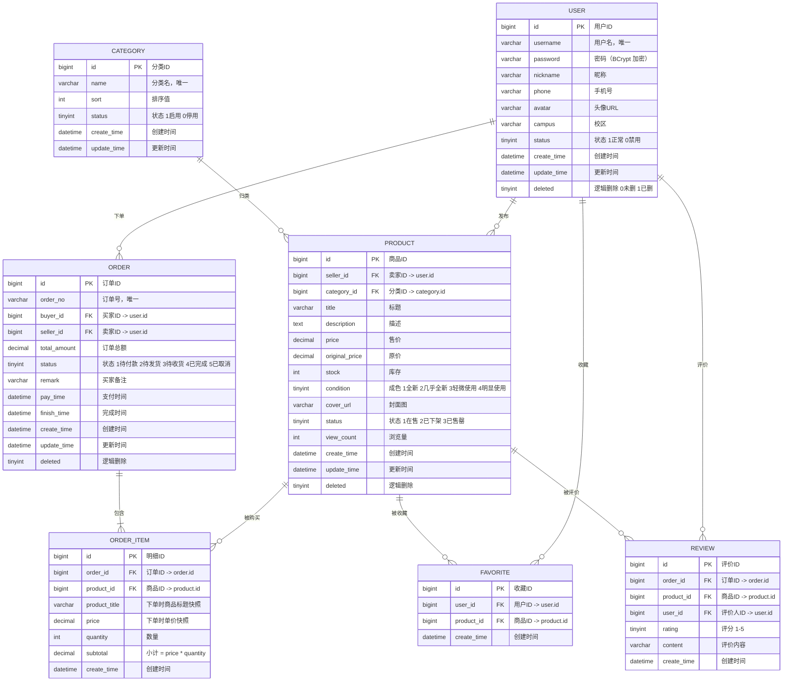

# CampusMart · 数据库 ER 图

## 实体关系图

## 设计说明

| 设计点 | 决策 | 理由 |
|---|---|---|
| 逻辑删除 | `deleted` 字段（MyBatis-Plus `@TableLogic`） | 二手交易有纠纷追溯需求，不物理删 |
| 时间字段 | `create_time` / `update_time` 自动填充 | MP `MetaObjectHandler` 统一处理，不靠手写 |
| 金额类型 | `decimal(10,2)` | **绝不用 float/double**，精度丢失 |
| 订单明细 | 存商品标题与单价**快照** | 商品改价/改名后，历史订单金额不可变 |
| 库存 | 放在 `product.stock`，后续用乐观锁/Redis 防超卖 | 第 3 天先做基础 CRUD，并发在后续周处理 |
| 索引规划 | `user.username` 唯一索引；`product(seller_id)`、`product(category_id)`、`order(buyer_id)`、`favorite(user_id, product_id)` 联合唯一 | 按查询路径建索引 |

## 后续待办（写代码时再补）

- [ ] 是否拆出 `address`（收货地址）表
- [ ] 订单状态机：`1待付款 → 2待发货 → 3待收货 → 4已完成`，取消走 `5`
- [ ] 评价与订单的约束：一个订单项只能评价一次
