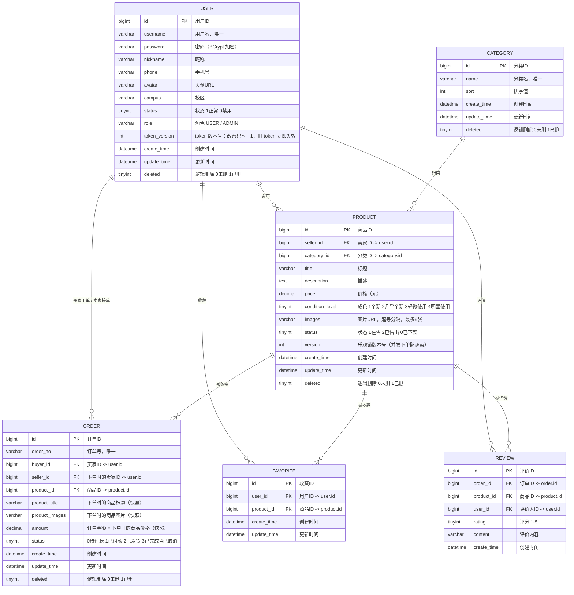

# CampusMart · 数据库 ER 图

## 实体关系图

```mermaid
erDiagram
    USER ||--o{ PRODUCT   : "发布"
    USER ||--o{ ORDER     : "买家下单 / 卖家接单"
    USER ||--o{ FAVORITE  : "收藏"
    USER ||--o{ REVIEW    : "评价"
    CATEGORY ||--o{ PRODUCT : "归类"
    PRODUCT  ||--o{ ORDER    : "被购买"
    PRODUCT  ||--o{ FAVORITE : "被收藏"
    PRODUCT  ||--o{ REVIEW   : "被评价"

    USER {
        bigint   id          PK "用户ID"
        varchar  username       "用户名，唯一"
        varchar  password       "密码（BCrypt 加密）"
        varchar  nickname       "昵称"
        varchar  phone          "手机号"
        varchar  avatar         "头像URL"
        varchar  campus         "校区"
        tinyint  status         "状态 1正常 0禁用"
        varchar  role           "角色 USER / ADMIN"
        int      token_version  "token 版本号：改密码时 +1，旧 token 立即失效"
        datetime create_time    "创建时间"
        datetime update_time    "更新时间"
        tinyint  deleted        "逻辑删除 0未删 1已删"
    }

    CATEGORY {
        bigint   id          PK "分类ID"
        varchar  name           "分类名，唯一"
        int      sort           "排序值"
        datetime create_time    "创建时间"
        datetime update_time    "更新时间"
        tinyint  deleted        "逻辑删除 0未删 1已删"
    }

    PRODUCT {
        bigint   id              PK "商品ID"
        bigint   seller_id       FK "卖家ID -> user.id"
        bigint   category_id     FK "分类ID -> category.id"
        varchar  title              "标题"
        text     description        "描述"
        decimal  price              "价格（元）"
        tinyint  condition_level    "成色 1全新 2几乎全新 3轻微使用 4明显使用"
        varchar  images             "图片URL，逗号分隔，最多9张"
        tinyint  status             "状态 1在售 2已售出 0已下架"
        int      version            "乐观锁版本号（并发下单防超卖）"
        datetime create_time        "创建时间"
        datetime update_time        "更新时间"
        tinyint  deleted            "逻辑删除 0未删 1已删"
    }

    ORDER {
        bigint   id             PK "订单ID"
        varchar  order_no          "订单号，唯一"
        bigint   buyer_id       FK "买家ID -> user.id"
        bigint   seller_id      FK "下单时的卖家ID -> user.id"
        bigint   product_id     FK "商品ID -> product.id"
        varchar  product_title     "下单时的商品标题（快照）"
        varchar  product_images    "下单时的商品图片（快照）"
        decimal  amount            "订单金额 = 下单时的商品价格（快照）"
        tinyint  status            "0待付款 1已付款 2已发货 3已完成 4已取消"
        datetime create_time       "创建时间"
        datetime update_time       "更新时间"
        tinyint  deleted           "逻辑删除 0未删 1已删"
    }

    FAVORITE {
        bigint   id          PK "收藏ID"
        bigint   user_id     FK "用户ID -> user.id"
        bigint   product_id  FK "商品ID -> product.id"
        datetime create_time    "创建时间"
        datetime update_time    "更新时间"
    }

    REVIEW {
        bigint   id          PK "评价ID"
        bigint   order_id    FK "订单ID -> order.id"
        bigint   product_id  FK "商品ID -> product.id"
        bigint   user_id     FK "评价人ID -> user.id"
        tinyint  rating         "评分 1-5"
        varchar  content        "评价内容"
        datetime create_time    "创建时间"
    }
```

## 设计说明

| 设计点 | 决策 | 理由 |
|---|---|---|
| 逻辑删除 | `deleted` 字段（MyBatis-Plus `@TableLogic`） | 二手交易有纠纷追溯需求，不物理删 |
| 时间字段 | `create_time` / `update_time` 自动填充 | MP `MetaObjectHandler` 统一处理，不靠手写 |
| 金额类型 | `decimal(10,2)` | **绝不用 float/double**，精度丢失 |
| 订单建模 | **不建 `order_item` 明细表**，商品标题/图片/金额快照直接内联在 `orders` | 校园二手每件商品都是孤品（一单一品），没有购物车、不会一次买多件 → 明细表是多余的 |
| 订单快照 | 订单存下单时的 `product_title` / `product_images` / `amount` | 商品改价/改名/删图后，**历史订单必须还能还原当时的事实**（订单是凭证） |
| 「库存」 | **不设 `stock` 字段** —— 校园二手每件都是孤品，没有"数量"这回事 | 防超卖 = 下单时把 `product.status` 从 `1在售` 改成 `2已售出`（配合乐观锁 `version`，Day3 加） |
| 索引规划 | `user.username` 唯一索引；`product(seller_id)`、`product(category_id)`、`order(buyer_id)`、`favorite(user_id, product_id)` 联合唯一 | 按查询路径建索引 |

## 后续待办（写代码时再补）

- [ ] 是否拆出 `address`（收货地址）表
- [x] 订单状态机：`0待付款 → 1已付款 → 2已发货 → 3已完成`，取消走 `4`（10.09 已定义）
- [ ] 评价与订单的约束：一个订单只能评价一次
- [ ] `product.version` 乐观锁字段（Day3 加，用于防超卖）
- [ ] `favorite` / `review` 两张表还没建（Week03 Day5 / Day6）

---

> 📌 **校准记录**：本文档于 **2026-10-09** 对照真实表结构校准过一次。
> 之前 `USER` / `CATEGORY` / `PRODUCT` / `ORDER` 四个实体都是 **9.10 设计期**写的，
> 后来实现时改了不少字段，图没跟着更新（比如 `product` 曾规划过 `stock` / `cover_url` /
> `view_count`，实际做成了「无库存 + 多图 `images`」）。
> ⚠️ **以后改表一定要回来改这里** —— 文档和代码不一致，早晚会咬人。
